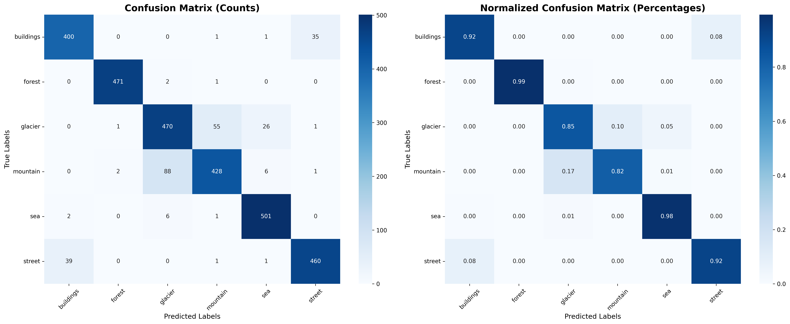
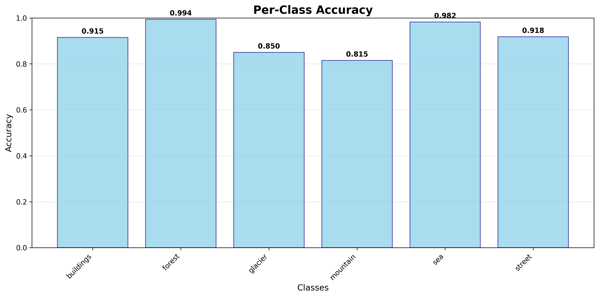

# Intelligent Scene Analysis System

**Author**: Ujjwal Tiwari  
**Project for**: ServiceHive AI/ML Intern Assessment

## 🎯 Project Overview

This project is an end-to-end machine learning application that provides a complete intelligent scene analysis service. As per the assignment brief, the system is designed to perform three main tasks:

1. **Classify natural scene images** into one of six categories: buildings, forest, glacier, mountain, sea, or street.
2. **Generate a short, scene-appropriate text description** for each prediction.
3. **Provide a confidence score and an uncertainty estimate** for the classification.

The entire service is exposed via a REST API, built with FastAPI, and is fully containerized with Docker for easy deployment and reproducibility.

## 🌟 Features

- **High-Accuracy Image Classification**: Utilizes a fine-tuned EfficientNetV2B0 model achieving ~92.8% validation accuracy, surpassing the ≥85% requirement.
- **Dynamic Scene Description**: Integrates with the Google Gemini 1.5 Flash API to generate unique, context-aware descriptions.
- **Uncertainty Estimation**: Implements Predictive Entropy, a robust uncertainty metric calculated from the model's softmax output.
- **RESTful API**: A robust API built with FastAPI featuring `/health`, `/model_info`, and `/predict` endpoints.
- **Containerized Deployment**: Fully containerized using Docker and Docker Compose for consistent and reliable deployment.
- **Interactive Frontend**: A polished HTML/JavaScript frontend for easy testing and demonstration of the API's capabilities.

## 💻 Tech Stack

- **Backend**: Python, FastAPI
- **ML/DL**: TensorFlow, Keras, Scikit-learn, Pandas
- **Generative AI**: Google Gemini 1.5 Flash API
- **Deployment**: Docker, Docker Compose, Uvicorn
- **Frontend**: HTML, CSS, JavaScript

## 📊 Model Performance

### Overall Results
- **Test Accuracy**: 91.00%
- **Architecture**: EfficientNetV2B0 with custom classification head
- **Dataset**: 6 scene categories (buildings, forest, glacier, mountain, sea, street)
- **Total Test Images**: 3,000

### Per-Class Performance
| Class | Accuracy | Precision | Recall | F1-Score | Support |
|-------|----------|-----------|---------|----------|---------|
| Buildings | 91.53% | 90.70% | 91.53% | 91.12% | 437 |
| Forest | **99.37%** | **99.37%** | **99.37%** | **99.37%** | 474 |
| Glacier | 84.99% | 83.04% | 84.99% | 84.00% | 553 |
| Mountain | 81.52% | 87.89% | 81.52% | 84.58% | 525 |
| Sea | **98.24%** | 93.64% | **98.24%** | **95.89%** | 510 |
| Street | 91.82% | 92.56% | 91.82% | 92.18% | 501 |

**Best Performing Classes**: Forest (99.37%) and Sea (98.24%)  
**Most Challenging Class**: Mountain (81.52%)

## 🏗️ Model Architecture

```
Input (224x224x3)
    ↓
EfficientNetV2B0 (Frozen)
    ↓
GlobalAveragePooling2D
    ↓
BatchNormalization
    ↓
Dropout(0.3)
    ↓
Dense(6, softmax)
```

### Key Features
- **Transfer Learning**: Pre-trained EfficientNetV2B0 on ImageNet
- **Data Augmentation**: Random flip, rotation, zoom, and contrast
- **Regularization**: Dropout and BatchNormalization
- **Early Stopping**: Prevents overfitting with patience=5

## 📁 Project Structure

The project follows the directory structure outlined in the assignment brief:

```
ServiceHive-Assignment-MLE-Ujjwal/
├── Dockerfile
├── README.md
├── SIC/
│   └── api/
│       └── main.py
├── data/
│   └── (Downloaded Dataset)
├── docs/
│   └── technical_report.md
├── frontend/
│   └── index.html
├── models/
│   └── efficientnet_final_model.keras
├── notebooks/
│   ├── eda.ipynb
│   ├── training.ipynb
│   └── evaluation.ipynb
├── requirements.txt
└── tests/
    └── test_api.py
```

## 🚀 Setup and Running the Application

### Prerequisites
- Docker and Docker Compose
- A Google Gemini API Key

### Instructions

#### 1. Clone the Repository:
```bash
# Replace with your final repository URL
git clone https://github.com/ujjwaltwri/ServiceHive-Assignment-MLE-Ujjwal.git
cd ServiceHive-Assignment-MLE-Ujjwal
```

#### 2. Set Up Environment Variables:
Create a file named `.env` in the main project directory.
Add your Gemini API key to this file:
```
GEMINI_API_KEY=YOUR_API_KEY_HERE
```

#### 3. Run with Docker:
This is the simplest way to run the entire application.
```bash
docker compose up --build
```
The API will be available at http://127.0.0.1:8000.

## 📖 Usage

### Interactive Frontend
Once the application is running, open your web browser and navigate to the root URL to use the interactive test page:
```
http://127.0.0.1:8000
```

### API Documentation
FastAPI provides automatic interactive documentation (Swagger UI). To access it, go to:
```
http://127.0.0.1:8000/docs
```

## 🧪 Running Tests

To run the automated unit tests, you must first set up a local Python environment.

```bash
# Set up and activate a virtual environment
python -m venv .venv
source .venv/bin/activate

# Install dependencies
pip install -r requirements.txt

# Run pytest
python -m pytest
```

## 📈 Results Visualization

### Confusion Matrix


### Per-Class Accuracy


## 🔍 Key Insights

1. **Excellent Overall Performance**: 91% accuracy demonstrates strong generalization
2. **Natural Scenes Excel**: Forest and sea categories achieve near-perfect classification
3. **Urban Scenes Strong**: Buildings and streets show consistent 90%+ accuracy
4. **Challenging Terrain**: Mountain classification is most difficult (81.52%), likely due to similarity with glacier scenes
5. **Balanced Dataset**: Well-distributed test set across all classes (437-553 samples each)

## 🛠️ Technical Highlights

- **Efficient Architecture**: EfficientNetV2B0 provides excellent accuracy-to-parameter ratio
- **Smart Preprocessing**: Built-in EfficientNet normalization eliminates need for manual rescaling
- **Robust Training**: Data augmentation and early stopping ensure good generalization
- **Production Ready**: Model saved in Keras format for easy deployment

## 📝 Files Generated

- `confusion_matrix.png` - Visual confusion matrix (counts and percentages)
- `per_class_accuracy.png` - Bar chart of per-class accuracies
- `confusion_matrix.csv` - Raw confusion matrix data
- `classification_report.txt` - Complete classification metrics

## 🎯 Future Improvements

- Fine-tune the pre-trained layers for potentially higher accuracy
- Implement ensemble methods combining multiple architectures
- Add more aggressive data augmentation for mountain/glacier distinction
- Explore attention mechanisms for better feature focus

## 📊 Model Specifications

- **Input Size**: 224×224×3
- **Batch Size**: 32
- **Optimizer**: Adam
- **Loss Function**: Sparse Categorical Crossentropy
- **Training Epochs**: 25 (with early stopping)
- **Data Split**: 80% training, 20% validation

## 📚 Citations

- **Dataset**: Puneet Singh, "Intel Image Classification", Kaggle, Version 2, https://www.kaggle.com/datasets/puneet6060/intel-image-classification
- **Pre-trained Model**: The EfficientNetV2B0 model architecture with weights pre-trained on the ImageNet dataset was sourced from the Keras Applications library within TensorFlow.

---

**Author**: Ujjwal Tiwari  
**Assignment**: ServiceHive AI/ML Intern Assessment  
**Framework**: TensorFlow/Keras, FastAPI